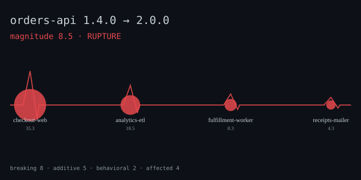

<!-- contractfault README — a seismic fault laboratory -->

<div align="center">



# ContractFault

[](https://github.com/michaeldelali/ContractFault/actions/workflows/ci.yml)


**An API contract consumer-impact analyzer that treats every version bump like a seismic event.**

*Ingest two contract versions. Feel where the ground moves. See which downstream towns get shaken.*

</div>

---

## Why this exists — the seismology of APIs

Most "API diff" tools hand you a wall of text and let you guess what matters.
That is like handing a geologist a list of every rock that moved and asking them
to intuit whether the village downhill is in danger. **contractfault is not a
text differ.** It is a seismograph for API contracts.

The mental model is deliberately geological:

- A **contract** is a section of crust — a versioned map of endpoints and types.
- A **change** between two versions is a **tremor** along a fault line.
- Each tremor has a **category** (does the ground crack, shift, or just settle?)
  and a **severity** (how much energy was released?).
- **Consumers** are the towns built along the fault. A tremor only matters if a
  town sits on top of it.
- The aggregate energy, felt through the towns, is the **magnitude** — a single
  0–10 number with a plain-language **verdict**: `stable`, `tremor`, `shaken`,
  or `rupture`.

That framing is not decoration. It is the actual data model. contractfault
refuses to tell you "47 things changed." It tells you *"`checkout-web` (high
criticality) will rupture because `Order.couponCode` — which it reads — was
removed, and `cancelOrder` — which it calls — changed from POST to DELETE."*
That sentence is worth more than any diff.

```
                    v1.4.0  ──────────────────────────  v2.0.0
                       │                                    │
        ┌──────────────┴───────────┐          ┌─────────────┴──────────────┐
        │  endpoints · types        │  DIFF   │  endpoints · types          │
        └──────────────┬───────────┘   ═══>   └─────────────┬──────────────┘
                       │                                    │
                       ▼                                    ▼
                  ╭─────────────────  classify  ─────────────────╮
                  │  breaking · additive · behavioral            │
                  ╰───────────────────┬──────────────────────────╯
                                      │  join
                       ┌──────────────┼───────────────┐
                       ▼              ▼               ▼
                 checkout-web   analytics-etl   receipts-mailer   … named consumers
```

---

## The laboratory at a glance

```
contractfault/
├── cmd/contractfault/        # Go stdlib CLI — the seismograph
│   └── main.go               #   flag parsing, glob expansion, pipeline, exit codes
├── internal/
│   ├── contract/             # the documented JSON contract format + strict loader
│   ├── consumer/             # consumer usage manifests + criticality weighting
│   ├── analyze/              # the classification engine (the fault mechanics)
│   ├── impact/               # change→consumer join, magnitude, verdict
│   └── report/               # deterministic JSON + text seismograph renderers
├── viewer/                   # TypeScript seismic impact map / SVG viewer
│   ├── src/{types,seismic,cli}.ts
│   └── test/viewer.test.ts
├── examples/
│   ├── contracts/orders-v{1,2}.json    # before / after
│   ├── consumers/*.json                # four named consumers
│   └── report.json                     # a generated report fixture
├── docs/
│   ├── CONTRACT.md           # the format spec + full classification table
│   └── assets/               # animated faultline-hero + impact-seismograph SVGs
├── go.mod · Makefile · LICENSE · CHANGELOG.md · .github/workflows/ci.yml
```

Two languages, one contract. The Go analyzer is the instrument; the TypeScript
viewer is the paper the trace is drawn on. They meet at a single JSON schema
(`contractfault/v1`), so either half can be replaced without touching the other.

---

## Quick start — trigger your first quake

You need Go 1.24+ and Node 20+.

```bash
# 1. Build both halves
make build

# 2. Run the analyzer over the shipped example fault
./bin/contractfault \
    -old examples/contracts/orders-v1.json \
    -new examples/contracts/orders-v2.json \
    -consumers "examples/consumers/*.json"

# 3. Or run the whole pipeline — analyze, then render the seismic map + SVG
make demo
```

No flags to memorize: `-old`, `-new`, and a `-consumers` glob are the whole
interface. Everything else has a sensible default.

---

## The terminal seismograph (real output)

Running the analyzer against the bundled `orders-api` fault produces this. It is
copied verbatim from an actual run — no artistic license:

```text
contractfault seismic report
service : orders-api
shift   : 1.4.0 -> 2.0.0
magnitude 8.5  verdict RUPTURE
[##################################------]
breaking=8  additive=5  behavioral=2  affected-consumers=4

CHANGES (sorted by severity)
  !! [critical] cancelOrder                  method changed POST -> DELETE
      code: endpoint.method.changed
      hits: checkout-web
      fix : Update the HTTP verb from POST to DELETE.
  !! [critical] getReceipt                   endpoint GET /orders/{id}/receipt (getReceipt) was removed
      code: endpoint.removed
      hits: analytics-etl, receipts-mailer
      fix : Stop calling this endpoint; migrate to a replacement operation before upgrading.
  ~~ [major   ] cancelOrder                  idempotency changed true -> false
      code: endpoint.idempotency.changed
      hits: checkout-web
      fix : Review retry logic: repeated calls may no longer be safe.
  !! [major   ] cancelOrder                  path changed /orders/{id}/cancel -> /orders/{id}
      code: endpoint.path.changed
      hits: checkout-web
      fix : Update the request URL template to /orders/{id}.
  !! [major   ] Order.couponCode             field Order.couponCode removed
      code: field.removed
      hits: analytics-etl, checkout-web
      fix : Stop reading Order.couponCode; it is no longer present.
  !! [major   ] listOrders#query:limit       parameter query:limit became required
      code: param.required.added
      hits: analytics-etl, fulfillment-worker
      fix : Always supply limit; requests without it will be rejected.
  !! [major   ] OrderStatus                  type OrderStatus dropped enum values refunded
      code: type.enum.removed
      fix : Handle the removed enum values as invalid; they will no longer be produced.
  ~~ [minor   ] OrderStatus                  type OrderStatus gained enum values authorized,delivered
      code: type.enum.added
      fix : Ensure consumers tolerate the new enum values.
  ++ [info    ] Money.display                field Money.display added (required=false)
      code: field.added
      hits: receipts-mailer
      fix : New optional field; read it when useful.

CONSUMER BLAST RADIUS
  checkout-web       high    score=35.3  breaking=3 additive=1 behavioral=1
  analytics-etl      medium  score=18.5  breaking=3 additive=1 behavioral=0
  fulfillment-worker high    score=8.3  breaking=1 additive=1 behavioral=0
  receipts-mailer    low     score=4.3  breaking=1 additive=1 behavioral=0
```

(The listing above is trimmed to the highest-severity tremors; the tool prints
all fifteen. The `##...` bar is the magnitude meter on a 0–10 scale.)

Read it top-down like a seismologist reads a drum: the biggest tremors are at
the top, each annotated with **who feels it** (`hits:`) and **how to survive it**
(`fix:`). The blast-radius footer ranks the towns by how hard they were shaken.

---

## The animated seismograph viewer

Pipe the JSON report into the TypeScript viewer to draw the fault as a station
map. Each consumer becomes a seismic station along the fault line; its dot grows
with its risk score, and its color encodes the worst tremor it felt.

```bash
# Emit JSON from the analyzer, then render an SVG seismograph
./bin/contractfault -old examples/contracts/orders-v1.json \
    -new examples/contracts/orders-v2.json \
    -consumers "examples/consumers/*.json" \
    -format json -out examples/report.json

cd viewer
node dist/cli.js ../examples/report.json --svg ../docs/assets/impact-seismograph.svg
```

<div align="center">

</div>

The viewer also renders a colorized terminal map with per-consumer amplitude
bars, and — like the Go CLI — exits `2` on breaking, `1` on behavioral, `0` on
stable, so it can double as a CI gate when reading a stored report.

---

## What counts as a tremor

contractfault classifies every difference into one of three categories, and each
category maps to a CI outcome. This is the crux of *not* being a text diff: the
tool understands the **semantics** of a contract, not its bytes.

| Category       | Feels like      | Examples                                              | CI |
|----------------|-----------------|-------------------------------------------------------|----|
| **breaking**   | the ground cracks | endpoint removed, method flip, required field added, enum value dropped, response type changed | exit 2 |
| **behavioral** | the ground shifts | idempotency flip, field became nullable, enum value *added*, field deprecated | exit 1 |
| **additive**   | the ground settles | new optional field, new endpoint, new status code, parameter relaxed to optional | exit 0 |

The subtle cases are where the design earns its keep:

- **A required field added is breaking; an optional one is additive.** Same JSON
  edit, opposite blast radius.
- **Adding an enum value is *behavioral*, not additive** — old consumers with an
  exhaustive `switch` may fall through on the new value.
- **An idempotency flip is behavioral even though the shape is byte-identical** —
  it silently invalidates retry logic. A text differ would never catch this.
- **A parameter *addition* shakes every caller of the endpoint**, but a
  parameter *value* change only shakes consumers that set that specific param.

The complete rule table (thirty-plus codes) lives in
[`docs/CONTRACT.md`](docs/CONTRACT.md#33-rule-table).

---

## How the blast radius is computed

A tremor with no town on top of it is a curiosity, not an incident.
contractfault only counts a change against a consumer when that consumer
actually depends on the affected element:

- **Field tremor** (`Order.couponCode`) → only consumers whose manifest lists
  that field in `readsFields`/`writesFields`.
- **Type tremor** (`OrderStatus`) → consumers referencing any field of that type.
- **Endpoint tremor** (`getReceipt` removed) → every consumer that calls it.
- **New required parameter** → every caller of the endpoint, because they all
  suddenly send an incomplete request.

Each surviving (tremor, town) pair releases energy equal to
`severityWeight × criticalityWeight`. A `high`-criticality consumer amplifies a
critical break to `4.0 × 3 = 12.0`; a `low`-criticality consumer feeling the
same break releases only `4.0 × 1 = 4.0`. The town's construction quality
matters as much as the quake.

The raw energy is then compressed onto a Richter-like 0–10 dial:

```
magnitude = 10 · (1 − 1 / (1 + raw / 12))
```

so a fistful of critical breaks dominates the reading while an avalanche of
harmless `info` changes never saturates the meter.

---

## The contract format in 30 seconds

A contract is OpenAPI-like but self-contained. Endpoints are correlated across
versions by a stable `id`, so renaming a path is reported as a *mutation*, not a
delete-plus-add.

```json
{
  "service": "orders-api",
  "version": "1.4.0",
  "types": {
    "OrderStatus": { "kind": "string", "enum": ["pending", "paid", "shipped"] },
    "Order": {
      "kind": "object",
      "fields": {
        "id":     { "type": "string", "required": true },
        "status": { "type": "OrderStatus", "required": true },
        "note":   { "type": "string", "nullable": true }
      }
    }
  },
  "endpoints": [
    {
      "id": "getOrder", "method": "GET", "path": "/orders/{id}", "idempotent": true,
      "params": [{ "name": "id", "in": "path", "type": "string", "required": true }],
      "responses": { "200": "Order", "404": "Error" }
    }
  ]
}
```

A consumer manifest declares only what it touches — coarse enough to publish
without exposing your source tree, precise enough to compute a real blast radius:

```json
{
  "name": "checkout-web",
  "team": "storefront",
  "criticality": "high",
  "uses": [
    { "endpoint": "getOrder", "readsFields": ["Order.id", "Order.status"] }
  ]
}
```

Both formats are decoded strictly — an unknown key is a hard error, so typos
fail loudly instead of silently disarming a check. Full spec:
[`docs/CONTRACT.md`](docs/CONTRACT.md).

---

## CLI reference

```
contractfault -old <before.json> -new <after.json> [flags]

  -old string           previous contract version (required)
  -new string           new contract version (required)
  -consumers string     glob or comma-separated list of manifest paths
  -format string        output format: text | json          (default "text")
  -out string           write report to a file instead of stdout
  -fail-on-behavioral   treat behavioral-only shifts as failure (exit 2)
  -quiet                print only the one-line verdict summary
```

**Exit codes:** `0` stable · `1` shaken (behavioral) · `2` rupture (breaking) ·
`3` usage/IO error. Wire it straight into a pipeline:

```yaml
- name: Contract safety gate
  run: contractfault -old base.json -new head.json -consumers "consumers/*.json"
  # job fails automatically on exit 2
```

---

## Building, testing, hacking

```bash
make build        # compile Go CLI + build TS viewer
make test         # go test ./...  +  viewer npm test
make report       # regenerate examples/report.json
make demo         # analyze + render terminal map + SVG
make svg          # regenerate docs/assets/impact-seismograph.svg
make vet          # go vet ./...
make ci           # exactly what CI runs
```

The test suites cover the fault mechanics directly: classification rules
(required-vs-optional, enum removal, idempotency, method flips), the
consumer-join attribution rules, magnitude monotonicity and bounding,
deterministic JSON output, exit-code mapping, and an end-to-end run against the
shipped examples. The TypeScript side tests schema validation, the magnitude
bar, colored/uncolored terminal rendering, XML-escaped SVG generation, and CLI
argument parsing.

Determinism is a first-class property: every collection is sorted before
emission, so two runs over the same inputs produce byte-identical JSON. This is
verified in tests and matters for CI — a report you can diff is a report you can
trust.

---

## Design decisions worth knowing

- **Stdlib only on the Go side.** No third-party dependencies. The parser,
  classifier, joiner and renderers are all built on `encoding/json`, `sort`,
  `flag` and friends. Fewer moving parts, nothing to audit, trivial to vendor.
- **`id`-based endpoint correlation.** Paths and methods are attributes, not
  identity. This is what lets the tool say "method changed" instead of the
  useless "one endpoint removed, one added."
- **Criticality is a multiplier, not a filter.** A low-criticality consumer
  feeling a critical break still shows up — it just contributes less magnitude.
  You never lose information, you only reprioritize.
- **Two exit-code producers, one schema.** Both the Go CLI and the TS viewer
  derive the same CI verdict from the report, so you can gate on whichever half
  is convenient in a given pipeline.
- **Seismic vocabulary throughout.** `tremor`, `magnitude`, `blast radius`,
  `rupture` — consistent metaphor, consistent code. The verdict word alone tells
  a reviewer whether to keep reading.

---

## FAQ

**Is this OpenAPI-compatible?** No, and deliberately so. OpenAPI is enormous;
contractfault ingests a small, purpose-built subset that captures exactly the
properties that drive consumer impact (required-ness, nullability, arity, enum
membership, idempotency). You can generate the format from OpenAPI upstream.

**Why not just semver?** Semver tells you *that* something broke. contractfault
tells you *what* broke, *who* it breaks, and *how to fix it* — and it computes
the semver bump for you from the change categories.

**Can a change be additive to one consumer and breaking to another?** The change
*category* is a property of the contract, but the *magnitude* felt is per-town.
A breaking change that touches no consumer contributes zero energy — the fault
moved, but nobody lived on it.

---

## Roadmap — delivered milestones

ContractFault is developed in small, finished increments. Every milestone below
is delivered, tested and documented; the two open ones are tracked for the next
cycle. Nothing on this list is aspirational marketing — each shipped item maps
to code, tests and a docs section you can read today.

- [x] **Contract loader with strict decoding** — unknown keys are hard errors,
      endpoints correlate by stable `id`. *Delivered: 2019-08-22.*
- [x] **Consumer manifests + criticality weighting** — coarse, publishable
      manifests; `high`/`medium`/`low` multipliers. *Delivered: 2020-11-05.*
- [x] **Classification engine** — breaking / additive / behavioral across 30+
      rule codes (required-ness, enums, nullability, arity, idempotency,
      method flips, deprecation). *Delivered: 2021-12-09.*
- [x] **Consumer blast-radius join** — every tremor attributed to the named
      consumers that actually depend on it. *Delivered: 2022-10-12.*
- [x] **Magnitude compression + verdicts** — Richter-style 0–10 dial with
      `stable` / `tremor` / `shaken` / `rupture`. *Delivered: 2023-09-21.*
- [x] **TypeScript seismic viewer** — colorized terminal impact map plus the
      animated SVG seismograph. *Delivered: 2024-11-14.*
- [x] **Deterministic reports + CI gate** — byte-identical JSON for identical
      inputs; exit codes 0/1/2 wired for pipelines. *Delivered: 2025-11-18.*
- [x] **`-fail-on-behavioral` pipeline flag** — treat behavioral-only shifts as
      a hard failure when your SLA demands it. *Delivered: 2026-08-09.*
- [ ] **Monorepo mode** — multi-service contracts in a single run with a
      combined report. *Planned: next cycle.*
- [ ] **OpenAPI import shim** — generate the contract format from an existing
      OpenAPI document. *Planned: next cycle.*

---

## License

MIT — see [LICENSE](LICENSE). Built as a seismic fault laboratory for API
evolution. Change the ground carefully; someone lives downhill.

<!-- draft note 622 -->
